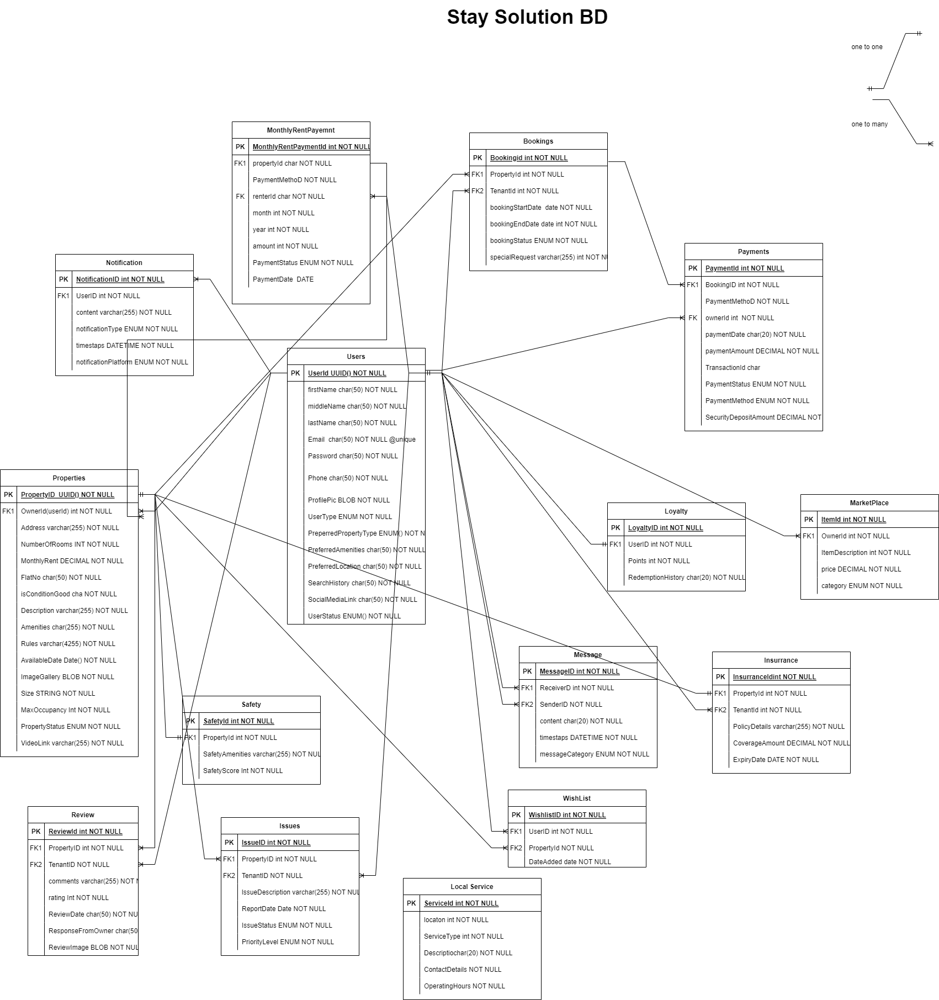

# StaySolutionBD Backend

Welcome to the backend repository of StaySolutionBD, the comprehensive  of solution rental services. This platform stands as the connective tissue between property owners and potential renters, enabling a fluid exchange of value and convenience. Developed with a senior engineer’s acumen and foresight, this backend architecture is the heartbeat of a service that simplifies and enhances the rental experience.

## Live Access
Explore StaySolutionBD in it's full advantage:
- [Live Server](https://stay-solution-bd-backend.vercel.app/)
- [Frontend Server](https://github.com/EmranSWE/StaySolutionBD-frontend)
- - [Documentation](StaySolutionBD.pdf)
- Traverse our APIs with [Postman Workspace](https://martian-comet-596528.postman.co/workspace/New-Team-Workspace~4291e7f1-879e-4461-9d74-21bf9d590423/collection/27394351-094df829-23b0-4ef2-a540-4f7464feb98b?action=share&creator=27394351)

## Introduction

At the heart of the rental industry revolution, StaySolutionBD streamlines the rental process for property owners and tenants alike. This backend repository is a trove of meticulously crafted code that supports the server, database, and APIs - all harmonizing to ensure the frontend application's performance is nothing short of exceptional.

## Core Features

With a feature set as diverse as the market it serves, StaySolutionBD offers:
- **Robust User Registration**: Multi-faceted profiles tailored for property owners and renters.
- **Advanced Property Listing**: Owners exert full control with add, edit, and delete capabilities over their listings.
- **Smart Search and Filter**: Tenants find their ideal property using a variety of criteria.
- **Comprehensive Booking System**: Date-specific bookings with an integrated calendar.
- **Versatile Payment Integration**: Rent payments facilitated through multiple channels.
- **Dedicated Repair/Issue Reporting**: Issue ticketing system for maintenance concerns.
- **Secure Messaging System**: Encrypted communication between users.
- **Transparent Ratings and Reviews**: A feedback loop that promotes trust and quality.

## Tech Stack

### Frontend

- **Next.js**: Our React framework for server-side rendering and SEO optimization.
- **TypeScript**: Adding type safety and predictive coding to our development process.
- **Ant Design**: Crafting a visually appealing UI with a rich component library.
- **Redux**: Managing application state with predictability.
- **Axios**: Handling HTTP requests with a promise-based architecture.
- **React Hook Form & Yup**: Streamlining form validation and management.

### Backend

- **Node.js & Express.js**: Our efficient runtime and framework duo for a fast and scalable API.
- **TypeScript**: For a strongly-typed backend that reduces errors and enhances collaboration.
- **Prisma**: Our ORM of choice for interacting with PostgreSQL in a type-safe manner.
- **Zod**: Enforcing schema validation for robust data handling.
- **Husky**: Keeping our codebase clean with Git hooks.
- **Cloudinary & Multer**: Handling file uploads and media management.
- **jsonwebtoken**: Securely managing authentication and session handling.

### Database

- **PostgreSQL**: The foundation of our data storage, renowned for its reliability and robustness.

# Database Entities and Relationships

The StaySolutionBD backend is driven by a well-structured relational database that ensures the integrity and efficiency of data management. Below is an overview of the primary entities in our database, their key attributes, and the relationships that link them together to reflect the real-world operations of our rental service platform.

## Model & Entities

### User
- `UserID`: Unique identifier for the user.
- `FirstName`: User's first name.
- `LastName`: User's last name.
- `Email`: User's email address, used for login.
- `Password`: Hashed password for user authentication.
- `Phone`: Contact number.
- `ProfilePic`: URL to the user's profile picture.
- `UserType`: Distinguishes between property owner and renter.
- `PreferredPropertyType`, `PreferredAmenities`, `PreferredLocation`: Preferences to tailor the search experience.
- `SearchHistory`, `BookingHistory`: Stores user's past activities for personalized services.
- `SocialMediaLinks`: Social media profile links for a richer user profile.
- `UserStatus`: Indicates if the user is active, suspended, etc.

### Property
- `PropertyID`: Unique identifier for the property.
- `OwnerID`: References the user who owns the property.
- `Address`, `Description`, `NumberOfRooms`, `Amenities`, `Rules`, `Pricing`: Details describing the property.
- `ImageGallery`: URLs to images showcasing the property.
- `AvailabilityCalendar`: Dates when the property is available for rent.
- `PropertyStatus`: Indicates if the property is available, booked, or under maintenance.

### Booking
- `BookingID`: Unique identifier for a booking.
- `TenantID`, `PropertyID`: Reference the user booking the property and the property itself.
- `StartDate`, `EndDate`: Rental period.
- `BookingStatus`: Status of the booking (confirmed, pending, canceled).
- `SpecialRequests`: Any special requests or considerations for the booking.

### Payment
- `PaymentID`: Unique identifier for a payment.
- `BookingID`: Links the payment to a specific booking.
- `Amount`: The total amount paid.
- `PaymentMethod`: Method used for the payment.
- `PaymentStatus`: Indicates if the payment is completed, pending, or failed.
- `PaymentDate`: The date when the payment was processed.
### MonthlyRentPayment
- `id`: Unique identifier for each rent payment transaction, generated as a UUID.
- `month`: Integer representation of the month for which rent is paid (e.g., 1 for January, 2 for February, etc.).
- `year`: Year for which the rent payment is applicable.
- `status`: The status of the payment (uses the `PaymentStatus` enum, similar to the Payment model).
- `amount`: The total amount of rent paid for the month.
- `paymentDate`: The date when the rent payment was made or processed.
- `propertyId`: References the property related to the rent payment.
- `renterId`: References the user (renter) who made the payment.
### Review
- `ReviewID`: Unique identifier for a review.
- `PropertyID`, `TenantID`: Link the review to the property and the tenant who posted it.
- `Rating`, `Comments`, `ReviewDate`: Assessment of the property by the tenant.

### Issue (Repair)
- `IssueID`: Unique identifier for an issue.
- `PropertyID`, `TenantID`: Reference the property and the tenant reporting the issue.
- `IssueDescription`, `IssueStatus`, `ReportDate`, `PriorityLevel`: Details and tracking information for the reported issue.

### Message
- `MessageID`: Unique identifier for a message.
- `SenderID`, `ReceiverID`: References the users involved in the communication.
- `Content`, `Timestamp`, `MessageCategory`: Contents and metadata of the message.

### Notification
- `NotificationID`: Unique identifier for a notification.
- `UserID`: Links the notification to a user.
- `Content`, `Timestamp`, `NotificationType`, `NotificationPlatform`: Details of the notification sent to the user.

### Wishlist
- `WishlistID`: Unique identifier for a wishlist entry.
- `UserID`, `PropertyID`: Reference the user and the property they are interested in.
- `DateAdded`: When the property was added to the wishlist.

## Relationships

### User to Property
- `Owns`: One-to-Many relationship where one user can own many properties, but each property has one owner.

### User to Booking
- `Books`: One-to-Many relationship where one user can have many bookings, but each booking is associated with one user (tenant).

### Property to Booking
- `Is Booked As`: One-to-Many relationship where one property can have many bookings over time, each associated with one property.

### Booking to Payment
- `Generates`: One-to-Many relationship where one booking can generate one or more payments.
- 
### Property to MonthlyRentPayment
- `Is Paid For`: One-to-Many relationship where one property can have multiple monthly rent payments associated with it.
- 
### User to MonthlyRentPayment
- `Pays`: One-to-Many relationship where one user (renter) can have multiple monthly rent payments associated with them.
- 
### Property to Review
- `Receives`: One-to-Many relationship where one property can receive many reviews, each associated with one property.

### User to Review
- `Writes`: One-to-Many relationship where one user can write many reviews.

### User to Message
- `Sends` and `Receives`: One-to-Many relationships for sent and received messages, respectively.

### User to Notification
- `Receives Notification`: One-to-Many relationship where one user can receive many notifications.

### User to Wishlist
- `Creates Wishlist`: One-to-Many relationship where one user can add many properties to their wishlist.

## API Endpoints

The StaySolutionBD backend provides a robust API to support a full range of operations, from user management to property listings and transactions. Below is a comprehensive list of endpoints that facilitate interaction with our platform.

### User Endpoints
- **Registration**: `POST /api/v1/user/signup` - Register a new user.
- **Login**: `POST /api/v1/user/login` - User login.
- **User Details**: `GET /api/v1/user/users/{id}` - Get user details by ID.
- **Update User**: `PATCH /api/v1/user/update-profile/{id}` - Update user details.
- **Delete User**: `DELETE /api/v1/user/users/{id}` - Delete a user.
- **Refresh Token**: `GET /api/v1/user/refresh-token` - Refresh authentication token for a user.

### Property Endpoints
- **Add Property**: `POST /api/v1/property/properties` - Add a new property.
- **Get All Properties**: `GET /api/v1/property/properties` - Get all properties.
- **Property Details**: `GET /api/v1/property/properties/{id}` - Get property details by ID.
- **Update Property**: `PUT /api/v1/property/properties/{id}` - Update property details.
- **Delete Property**: `DELETE /api/v1/property/properties/{id}` - Delete a property.

### Booking Endpoints
- **Create a Booking**: `POST /api/v1/booking/bookings` - Create a new booking.
- **Get Booking Details**: `GET /api/v1/booking/bookings/{id}` - Get booking details by ID.
- **Get Bookings for a User**: `GET /api/v1/user/users/{id}/bookings` - Get bookings for a specific user.
- **Update Booking**: `PUT /api/v1/booking/bookings/{id}` - Update a booking.
- **Cancel Booking**: `DELETE /api/v1/booking/bookings/{id}` - Cancel a booking.

### Payment Endpoints
- **Make Payment**: `POST /api/v1/payment/payments` - Make a new payment.
- **Get Payment Details**: `GET /api/v1/payment/payments/{id}` - Get payment details by ID.
- **Payments for a Booking**: `GET /api/v1/booking/bookings/{id}/payments` - Get payments for a specific booking.

### Monthly Rent Payment Endpoints
- **Create Monthly Rent Payment**: `POST /api/v1/monthly-rent-payments` - Record a new monthly rent payment.
- **Get Monthly Rent Payments for Property**: `GET /api/v1/properties/{propertyId}/monthly-rent-payments` - List all rent payments for a specific property.
- **Get Monthly Rent Payments for Renter**: `GET /api/v1/users/{renterId}/monthly-rent-payments` - List all rent payments for a specific renter.
- **Get Specific Monthly Rent Payment**: `GET /api/v1/monthly-rent-payments/{paymentId}` - Get details for a specific rent payment.
- **Update Monthly Rent Payment**: `PUT /api/v1/monthly-rent-payments/{paymentId}` - Update a specific rent payment.
- **Delete Monthly Rent Payment**: `DELETE /api/v1/monthly-rent-payments/{paymentId}` - Remove a rent payment record.

### Review Endpoints
- **Add a Review**: `POST /api/v1/review/reviews` - Add a review for a property.
- **Get Reviews for a Property**: `GET /api/v1/property/properties/{id}/reviews` - Get all reviews for a specific property.

### Issue (Repair) Endpoints
- **Report an Issue**: `POST /api/v1/issue/issues` - Report an issue for a property.
- **Get Issue Details**: `GET /api/v1/issue/issues/{id}` - Get issue details by ID.
- **Update an Issue**: `PUT /api/v1/issue/issues/{id}` - Update an issue status.

### Message Endpoints
- **Send a Message**: `POST /api/v1/message/messages` - Send a direct message to another user.
- **Get Messages for a User**: `GET /api/v1/user/users/{id}/messages` - Retrieve all messages for a specific user.

### Notification Endpoints
- **Create a Notification**: `POST /api/v1/notification/notifications` - Generate a new notification for user activities.
- **Get Notifications for a User**: `GET /api/v1/user/users/{id}/notifications` - Fetch all notifications for a specific user.
- **Delete a Notification**: `DELETE /api/v1/notification/notifications/{id}` - Remove a specific notification.

### Wishlist Endpoints
- **Add Property to Wishlist**: `POST /api/v1/wishlist/items` - Include a property in a user's wishlist.
- **View User Wishlist**: `GET /api/v1/user/users/{id}/wishlist` - View all wishlist properties for a user.
- **Remove Property from Wishlist**: `DELETE /api/v1/wishlist/items/{id}` - Delete a property from the wishlist.
### Safety Endpoints
- **Add Safety Record for Property**: `POST /api/v1/safety/records` - Create a safety record for a property.
- **Fetch Safety Records for Property**: `GET /api/v1/property/properties/{id}/safety` - Retrieve safety records for a specific property.

### Marketplace Endpoints
- **List an Item in Marketplace**: `POST /api/v1/marketplace/list` - Offer an item or service in the marketplace.
- **Browse Marketplace by Category**: `GET /api/v1/marketplace?category={category}` - View marketplace items by specific categories.
- **Update Marketplace Item**: `PUT /api/v1/marketplace/{itemId}` - Update details for an item listed in the marketplace.
- **Delete Marketplace Item**: `DELETE /api/v1/marketplace/{itemId}` - Remove an item listing from the marketplace.

### Insurance Endpoints
- **Purchase Insurance**: `POST /api/v1/insurance/purchase` - Buy an insurance policy for a property booking.
- **View Insurance Policies for User**: `GET /api/v1/user/users/{id}/insurance` - Retrieve all insurance policies associated with a user.

## Development and Testing

The StaySolutionBD backend is developed with a commitment to clean, efficient, and maintainable code. Our development process is designed to encourage best practices and facilitate a robust testing regime.

### Development Workflow

- **Version Control**: We use Git for version control, hosted on [GitHub/GitLab/Bitbucket]. All new features are developed on separate branches and merged into the main branch via pull requests.
- **Code Reviews**: Each pull request is reviewed by at least one other team member to ensure code quality, adherence to our coding standards, and to catch potential issues early.
- **Continuous Integration (CI)**: We employ CI tools to automate testing and build processes, ensuring that all merges into the main branch are tested.
- **Coding Standards**: Our codebase adheres to a set of coding standards for consistency and readability. We follow [Airbnb/Google/Standard] style guides for [JavaScript/TypeScript].
- **Documentation**: All functions and modules are documented in the code, and we maintain an updated README and a detailed API documentation for developers.
### Monitoring and Logging

- **Monitoring**: We monitor our application using tools like [New Relic/DataDog/Sentry] to track performance metrics and uptime.
- **Logging**: Comprehensive logging is in place for error tracking and to provide insights into the application's behavior in real-time.

This diligent approach to development and testing ensures that StaySolutionBD remains reliable, secure, and easy to maintain, all while continuously evolving to meet the needs of our users.

## Entity Relationship Diagram (ERD)

Our database schema is designed to optimize for efficiency and scalability, ensuring that StaySolutionBD can handle a growing number of users and an increasing volume of data. The Entity Relationship Diagram (ERD) is a crucial part of our documentation, providing a clear visual representation of the data model and the relationships between the different entities.

### Overview of the ERD

- **Users**: Central to our platform, containing details about renters and property owners.
- **Properties**: Listed by owners, containing details like location, amenities, and availability.
- **Bookings**: Connecting users to properties, with details about rental periods and statuses.
- **Payments**: Tracking financial transactions related to property bookings.
- **MonthlyRentPayments**: Specific entity for handling recurring rent payments.
- ... (and other entities like Reviews, Issues, Messages, Notifications, Wishlist, etc.)

### Relationships

- **One-to-Many**: For example, a single user can have multiple bookings, but each booking is associated with one user.
- **Many-to-Many**: For instance, users can have many properties on their wishlist, and each property can be on the wishlist of many users.
- **One-to-One**: Such as a property having one safety record.

### Navigating the ERD

Our ERD includes:

- **Tables**: Each table represents an entity in our database, such as `Users`, `Properties`, or `Bookings`.
- **Columns**: Attributes within the tables, such as `UserID`, `PropertyID`, etc.
- **Primary Keys (PK)**: Uniquely identifies each record within a table.
- **Foreign Keys (FK)**: Establishes a link between the data in two tables.
- **Relationship Lines**: Illustrate how tables are related, including cardinality and optionality of the relationships.

### Accessing the ERD

You can view the ERD here: [Link to ERD]

## Model Design

The model design for StaySolutionBD serves as the blueprint for our application's data architecture. Each model is defined with precision to ensure it captures all necessary data points and can gracefully handle future scalability and business logic requirements.

### User Model

- **UserID**: Primary key, auto-incremented.
- **FirstName**: String, required.
- **LastName**: String, required.
- **Email**: String, unique, required, validated with regex for email format.
- **Password**: String, required, encrypted with bcrypt for security.
- **Phone**: String, validated for phone number format.
- **ProfilePic**: String, URL to the profile image.
- **UserType**: Enum, can be either 'Owner' or 'Renter'.
- ... (additional fields like `PreferredPropertyType`, `PreferredAmenities`, etc.)

### Property Model

- **PropertyID**: Primary key, auto-incremented.
- **OwnerID**: Foreign key referencing `UserID`.
- **Address**: Text, required.
- **Description**: Text, required.
- **NumberOfRooms**: Integer, required.
- **Amenities**: Array of strings.
- **Rules**: Text.
- **Pricing**: Decimal, required.
- **ImageGallery**: Array of strings, URLs to images.
- **AvailabilityCalendar**: JSON, structure defining available dates.
- **PropertyStatus**: Enum, can be 'Available', 'Booked', or 'UnderMaintenance'.
- ... (and so on for other attributes).

### Booking Model

- **BookingID**: Primary key, auto-incremented.
- **TenantID**: Foreign key referencing `UserID`.
- **PropertyID**: Foreign key referencing `PropertyID`.
- **StartDate**: Date, required.
- **EndDate**: Date, required.
- **BookingStatus**: Enum, includes 'Confirmed', 'Pending', 'Cancelled'.
- ... (additional attributes as necessary).

### Payment Model

- **PaymentID**: Primary key, auto-incremented.
- **BookingID**: Foreign key referencing `BookingID`.
- **Amount**: Decimal, required.
- **PaymentMethod**: Enum, includes 'CreditCard', 'BankTransfer', 'PayPal', etc.
- **PaymentStatus**: Enum, includes 'Completed', 'Pending', 'Failed'.
- **PaymentDate**: DateTime.
- ... (other relevant payment attributes).

### MonthlyRentPayment Model

- **MonthlyRentPaymentID**: Primary key, auto-incremented.
- **PropertyID**: Foreign key referencing `PropertyID`.
- **RenterID**: Foreign key referencing `UserID`.
- **Month**: Integer, required.
- **Year**: Integer, required.
- **Amount**: Decimal, required.
- **Status**: Enum, includes 'Paid', 'Due', 'Overdue'.
- **PaymentDate**: DateTime.
- ... (any additional fields).

... (additional models like `Review`, `Issue`, `Message`, `Notification`, `Wishlist`, etc.)

### Relationships

- **User to Property**: One-to-Many (One user can own multiple properties).
- **User to Booking**: One-to-Many (A user can have multiple bookings).
- **Property to Booking**: One-to-Many (A property can have multiple bookings, one at a time).
- **Booking to Payment**: One-to-One (Each booking has one payment associated).
- ... (and so on for other models and relationships).

### Constraints and Validations

- All string fields have a maximum length to prevent overflow.
- Enum fields are constrained to the specified values.
- Dates are validated to ensure they fall within a logical range (e.g., booking dates).
- Relationships have cascading deletes where appropriate to maintain referential integrity.

## JSON Data Examples

Below are sample JSON payloads that illustrate the kind of data our APIs expect to receive (request bodies) and produce (response bodies). These examples enhance transparency and provide a clear understanding of data structures within our backend processes.

### User Registration (Request)

POST /api/v1/user/signup
{
  "firstName": "Jane",
  "lastName": "Doe",
  "email": "jane.doe@example.com",
  "password": "password123",
  "phone": "+1234567890",
  "userType": "Renter"
}
## Contributing

We welcome contributions from the community and are pleased to have you join us in developing StaySolutionBD, a platform that's simplifying the rental process for thousands. Whether you're fixing bugs, adding new features, improving documentation, or spreading the word, your help is appreciated.

### How to Contribute

1. **Explore Issues**: Check out the [issues](#) on our GitHub repository. Start with one that interests you or propose a new feature.

2. **Fork the Repository**: Click on the 'Fork' button at the top right of the repository. This will create a copy of the repository in your own GitHub account.

3. **Clone Your Fork**: Clone the forked repository to your machine. For example:
git clone https://github.com/your-username/staysolutionbd-backend.git

4. **Create a Branch**: Create a new branch for your modifications:
git checkout -b feature-branch-name

5. **Set Up the Development Environment**: Refer to our [Installation](#installation) section to set up your local development environment.

6. **Make Your Changes**: Write your code following our [coding standards](#coding-standards) and [development workflow](#development-workflow). Make sure to add or update tests as necessary.

7. **Test Your Changes**: Ensure your changes pass all the tests and do not introduce any new issues.

8. **Commit Your Changes**: Commit your changes with a clear and descriptive commit message. Here's an example:
git commit -m "Add a brief description of the change"

9. **Push to Your Fork**: Push your changes to your fork on GitHub:
git push origin feature-branch-name

10. **Submit a Pull Request (PR)**: Go to the repository on GitHub, and you'll see a prompt to submit a pull request. Write a clear description of the changes and reference the issue number if applicable.

11. **Code Review**: Await a code review from the maintainers. Engage in the conversation and make any requested changes. Once approved, a maintainer will merge your PR.

### Contribution Guidelines

- **Code of Conduct**: All contributors are expected to adhere to our [Code of Conduct](#).
- **Code Style**: Please ensure your code meets the style guidelines as described in our [Code Style Guide](#).
- **Documentation**: Update the README.md with details of changes to the interface, and provide examples if relevant.
- **Atomic Commits**: Submit small, focused commits that address specific issues or features to make the review process easier.

## Credits

StaySolutionBD stands on the shoulders of giants. Our platform is built using a number of open-source libraries and technologies, and we are deeply grateful to the community of developers who have contributed to these projects. We would like to give special thanks to the following:

- [Node.js](https://nodejs.org/): For providing a robust JavaScript runtime to power our server.
- [Express.js](https://expressjs.com/): For the fast and minimalist web framework that's a cornerstone of our application.
- [PostgreSQL](https://www.postgresql.org/): For the world's most advanced open source relational database.
- [Prisma](https://www.prisma.io/): For the next-generation ORM that we use for database management.
- [React](https://reactjs.org/): For the front-end library that powers our user interfaces.
- [Redux](https://redux.js.org/): For state management across our React applications.
- [Ant Design](https://ant.design/): For the comprehensive suite of UI components that enhance our app's usability.

If you've contributed to StaySolutionBD and we've somehow missed you, please let us know so we can add you to the list!

## Licensing

StaySolutionBD is proudly open-source and is provided to the public under the [MIT License](LICENSE). This license ensures that you can use, share, and adapt the work for your own projects with ease, while also contributing back to the open-source ecosystem.

The MIT License is one of the most permissive and flexible licenses available, promoting the collaborative development of software. For more details, please refer to the `LICENSE` file included in the repository.

We encourage you to join us in improving StaySolutionBD, and by doing so, contribute to the flourishing community of open-source software.
